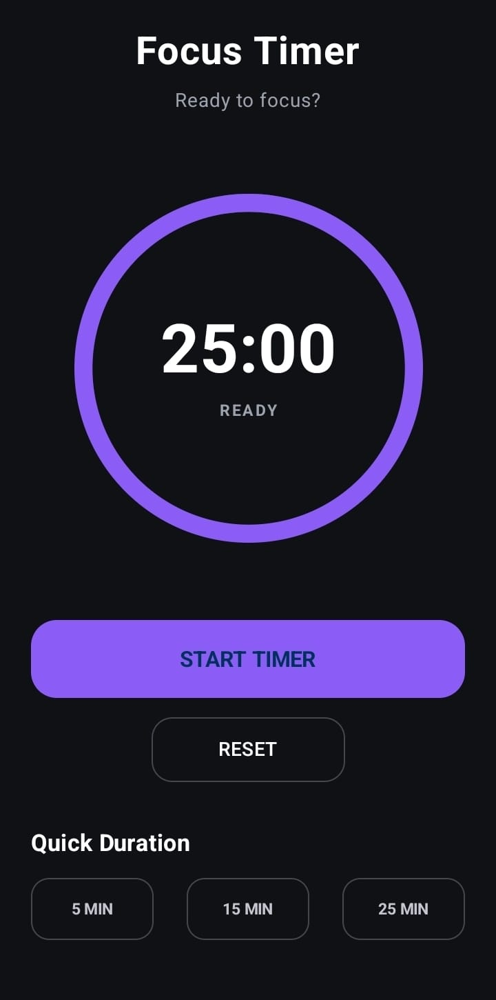

# Focus Timer App

A simple and clean Android focus timer application built using Kotlin and Jetpack Compose.

## App Screenshot



## About the App

Focus Timer is a simple productivity app that helps users focus on their tasks for a selected amount of time.

The app provides a countdown timer with a circular progress indicator and quick duration options. Users can start, pause, reset, or change the timer duration.

## Features

- Start the timer
- Pause the timer
- Reset the timer
- Quick duration selection
- 5-minute timer
- 15-minute timer
- 25-minute timer
- Circular progress indicator
- Displays remaining minutes and seconds
- Shows timer status
- Dark-themed user interface
- Simple and easy-to-use design

## How It Works

When the application starts, the timer is set to 25 minutes.

The user can:

1. Press **START TIMER** to start the countdown.
2. Press **PAUSE TIMER** to pause the countdown.
3. Press **RESET** to reset the timer.
4. Select **5 MIN**, **15 MIN**, or **25 MIN** to choose a different duration.

The circular progress indicator changes as the remaining time decreases.

When the timer reaches zero, it automatically stops.

## Technologies Used

- **Kotlin**
- **Android Studio**
- **Jetpack Compose**
- **Material 3**
- **Kotlin Coroutines**

## Project Structure

The main timer functionality is implemented in:

```text
app/
└── src/
    └── main/
        └── java/
            └── com/
                └── example/
                    └── timerapp2/
                        └── MainActivity.kt
